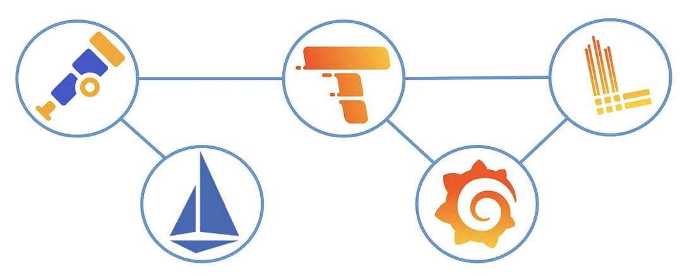

# Istio stack


Equip k8s cluster with the following components:
* Istio - Service Mesh
* OpenTelemetry - Monitoring
* Prometheus - Metrics
* Tempo - Tracing
* Loki - Logging
* Grafana - Visualization

## Getting started
### Istio
Install Istio with custom IstioOperator to use OpenTelemetry provider:
```bash
istioctl install -f istio/config.yaml
```

To enable the extensionProvider, we need to create a Telemetry resource:
```bash
kubectl apply -f istio/otel-tracing.yaml
```

### OpenTelemetry
Install cert-manager following https://cert-manager.io/docs/installation/helm/

Install `opentelemetry-operator` and related CRDs:
```bash
helm repo add open-telemetry https://open-telemetry.github.io/opentelemetry-helm-charts
helm repo update

kubectl create ns otel
helm install opentelemetry-operator open-telemetry/opentelemetry-operator -n otel
```

Configure the OpenTelemetry collector to receive, process and export the collected telemetry to the desired backends (which will be deployed soon) with a `OpenTelemetryCollector` resource:
```bash
kubectl apply -f opentelemetry/otel-collector.yaml -n otel
```

### Prometheus
Install Prometheus with `kube-prometheus-stack` Helm chart:
```bash
helm repo add prometheus-community https://prometheus-community.github.io/helm-charts
helm repo update

kubectl create ns prometheus
helm install prom prometheus-community/kube-prometheus-stack -n prometheus -f prometheus/values.yaml
```

Configure the Prometheus Operator to scrape the Istio control plane and workloads
```bash
kubectl apply -f prometheus/service-monitor.yaml
kubectl apply -f prometheus/pod-monitor.yaml
```

### Tempo
Tempo supports S3, GCS, Azure or filesystem as storage backends. In this example, we will use Azure as the storage backend.

Create a `Secret` with the Azure Storage Account credentials before installing Tempo:
```bash
kubectl create ns tempo
kubectl create secret generic stdstoragelog01-access-key -n tempo --from-literal=STORAGE_ACCOUNT_ACCESS_KEY=<account-key>
```

Install Tempo with `tempo-distributed` Helm chart:
```bash
helm repo add grafana https://grafana.github.io/helm-charts
helm repo update
helm install -f tempo/values.yaml tempo grafana/tempo-distributed -n tempo
```

You need to check if `OpenTelemetryCollector` is correctly sending traces to Tempo.

### Loki
Same as Tempo, Loki needs a storage backend too. In this example, we will use Azure as the storage backend.

Create a `Secret` with the Azure Storage Account credentials before installing Loki:
```bash
kubectl create ns loki
kubectl create secret generic stdstoragelog01-access-key -n loki --from-literal=STORAGE_ACCOUNT_ACCESS_KEY=<account-key>
```

Install Loki with `loki` Helm chart:
```bash
helm repo add grafana https://grafana.github.io/helm-charts
helm repo update
helm install -f loki/values.yaml -n loki loki grafana/loki
```

Export log from `OpenTelemetryCollector` to Loki is still experimental. Here we configure the `log` components installed on each node to send logs to Loki with a `PodLogs` resource:
```bash
kubectl apply -f loki/podlogs.yaml
```

### Grafana
Grafana may have been installed with `kube-prometheus-stack` Helm chart. If not, install it with helm chart:

#### Data source
Here shows how to configure Grafana to use Tempo and Loki as data source and correlate traces with logs.

Tempo:
```yaml
grafana:
  additionalDataSources:
  - name: Tempo
    type: tempo
    uid: tempo
    access: proxy
    url: http://tempo-query-frontend.tempo:3100
    jsonData:
      nodeGraph:
        enabled: true
```

Loki:
```yaml
grafana:
  additionalDataSources:
  - name: Loki
    editable: false
    type: loki
    uid: loki
    access: proxy
    url: http://loki-gateway.loki
    jsonData:
      derivedFields:
      - datasourceName: Tempo
        matcherRegex: "traceID=00-([^\\-]+)-"
        name: traceID
        url: "$${__value.raw}"
        datasourceUid: tempo
```

#### Dashboards
Istio dashboards can be found [here](https://grafana.com/orgs/istio/dashboards) and installed as `ConfigMap` resources.


## References
[Debugging microservices on Kubernetes with Istio, OpenTelemetry and Tempo — Part 1](https://medium.com/otomi-platform/debugging-microservices-on-k8s-with-istio-opentelemetry-and-tempo-4c36c97d6099)

[Debugging microservices on Kubernetes with Istio, OpenTelemetry and Tempo — Part 2](https://medium.com/otomi-platform/debugging-microservices-on-kubernetes-with-istio-opentelemetry-and-tempo-part-2-e10b951029a0)
